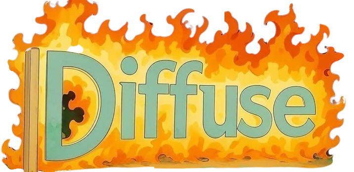

# Diffuse

<p align="center">
  
</p>

A Python package designed for research in diffusion-based generative modeling with modular components that can be easily swapped and combined for experimentation.

### 🎉 New Update
We now have **complete support for the whole FLUX pipeline**. 
Check out the [Flux Tutorial](https://diffuse.readthedocs.io/en/latest/flux_tutorial.html) to see how to run FLUX.1-dev with 4 different integrators (DDIM, Euler, Heun, DPM++2S) in under 50 lines of code.

## Quick Start

### Unconditional Generation

```python
import jax
from diffuse import Flow, Predictor, Denoiser
from diffuse.integrators import EulerIntegrator
from diffuse.timer import VpTimer

# Define flow matching model
flow = Flow(tf=1.0)

# Create predictor with your neural network
predictor = Predictor(
    model=flow,
    network=network_fn,
    prediction_type="velocity",  # or "noise", "sample"
)

# Setup timer and integrator
timer = VpTimer(n_steps=100, eps=0.001, tf=1.0)
integrator = EulerIntegrator(model=flow, timer=timer)

# Create denoiser
denoiser = Denoiser(
    integrator=integrator,
    model=flow,
    predictor=predictor,
    x0_shape=(height, width, channels),
)

# Generate samples
key = jax.random.PRNGKey(42)
state, trajectory = denoiser.generate(
    rng_key=key,
    n_steps=100,
    n_particles=10,
    keep_history=False,
)

# Single denoising step
next_state = denoiser.step(rng_key, state)  # x_t -> x_{t-1}
```

### Conditional Generation with DPS

```python
import jax
from diffuse import Flow, Predictor
from diffuse.integrators import EulerIntegrator
from diffuse.denoisers import DPSDenoiser
from diffuse.timer import VpTimer

# Define flow matching model
flow = Flow(tf=1.0)

# Create predictor
predictor = Predictor(
    model=flow,
    network=network_fn,
    prediction_type="velocity",
)

# Setup timer and integrator
timer = VpTimer(n_steps=100, eps=0.001, tf=1.0)
integrator = EulerIntegrator(model=flow, timer=timer)

# DPS denoiser for conditional sampling
dps = DPSDenoiser(
    integrator=integrator,
    model=flow,
    predictor=predictor,
    forward_model=forward_model,
    x0_shape=(height, width, channels),
)

# Generate conditional samples
key = jax.random.PRNGKey(42)
state, trajectory = dps.generate(
    rng_key=key,
    measurement_state=measurement_state,
    n_steps=100,
    n_particles=10,
)

# Single conditional step
next_state = dps.step(rng_key, state, measurement_state)  # x_t -> x_{t-1}
```

## Features

- **Flow Matching & Diffusion**: Support for both flow-based models and SDE-based diffusion processes
- **Flexible Prediction Types**: Velocity, noise, and sample prediction for different model architectures
- **Timer-aware Integration**: Advanced timing schemes (VpTimer, HeunTimer, FluxTimer) for improved sampling
- **Multiple Integrators**: EulerIntegrator, DDIMIntegrator, DPM++, Heun, and more
- **Conditional Sampling**: DPS (Diffusion Posterior Sampling) for inverse problems and conditioning
- **Modular Design**: Mix and match models, predictors, denoisers, integrators, and timers
- **JAX-Powered**: Efficient computation with automatic differentiation and JIT compilation
- **Research-Focused**: Built for experimentation with new diffusion and flow matching techniques
- **Examples**: MNIST, Gaussian mixtures, text-to-image generation, and more

## Installation

```bash
pip install diffuse-jax
```
or with uv

```bash
uv add diffuse-jax
```

## Examples

See the `examples/` directory for implementations including:
- MNIST digit generation
- Gaussian mixture modeling
- Conditional sampling demonstrations

## Citation

If you use Diffuse in your research, please cite the library:

```bibtex
@software{diffuse2024,
  title = {Diffuse: A modular diffusion model library},
  author = {Iollo, J., Oudoumanessah G.},
  year = {2025},
  url = {https://github.com/jcopo/diffuse}
}
```
